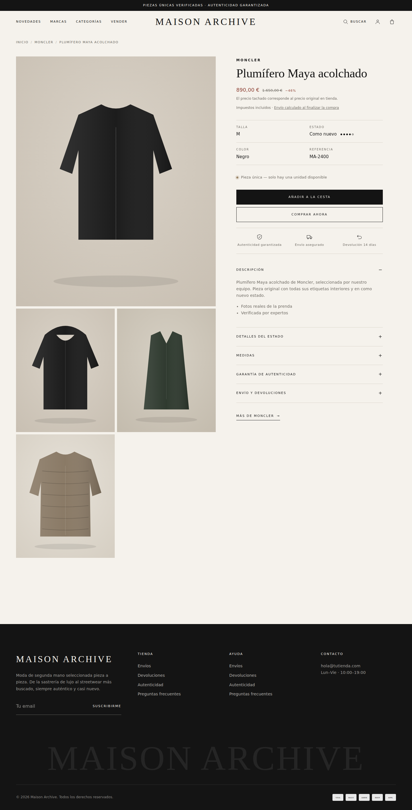
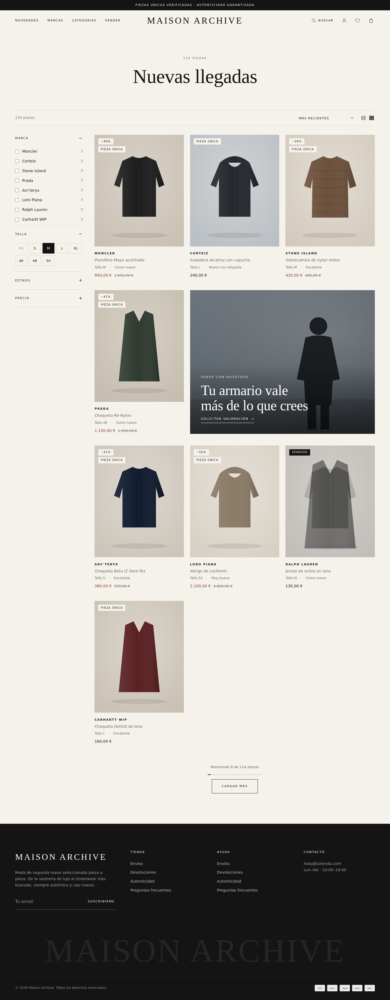
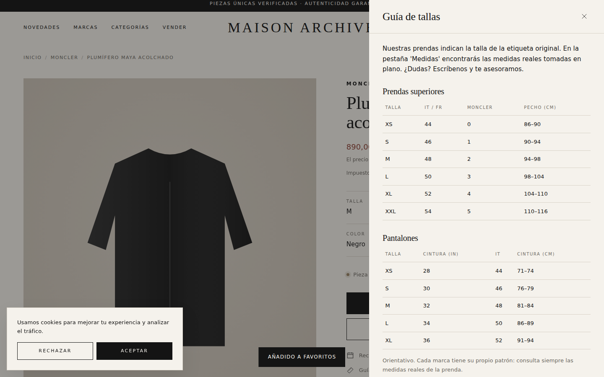
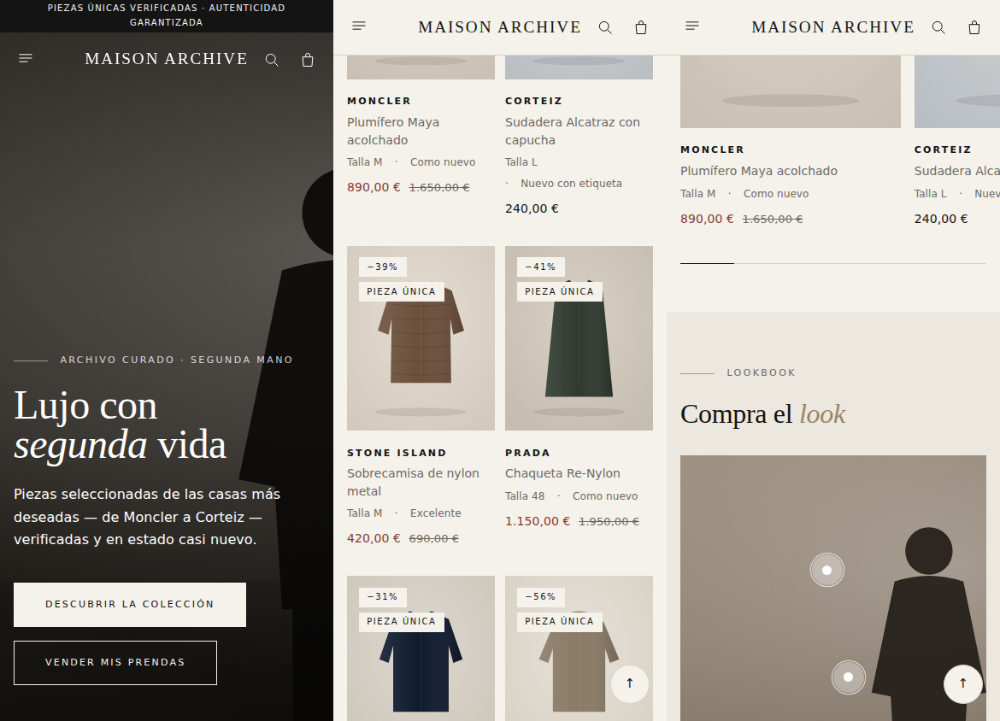

# Maison Archive — Tema Shopify para moda de segunda mano premium

Tema **Shopify Online Store 2.0** hecho a medida para una tienda de ropa de segunda mano
"casi nueva" que mezcla lujo (Moncler, Prada, Loro Piana…) y streetwear (Corteiz, Stone Island,
Carhartt WIP…) con una estética **editorial, elegante y profesional**.

Todo se edita desde el **personalizador visual de Shopify** (Tienda online → Temas → Personalizar),
sin tocar código. El nombre de la tienda se toma automáticamente de Shopify.


| Ficha de producto | Colección | Guía de tallas |
|---|---|---|
|  |  |  |



> Las capturas usan imágenes de muestra; con las fotos reales de las prendas se verá mucho mejor.

---

## 1. Instalación (5 minutos)

1. Genera el `.zip` del tema:
   ```bash
   ./build-zip.sh          # crea dist/maison-archive-theme.zip
   ```
   (o comprime el **contenido** de la carpeta `theme/`, de forma que `layout/`, `sections/`… queden en la raíz del zip).
2. En Shopify: **Tienda online → Temas → Añadir tema → Subir archivo zip**.
3. Pulsa **Personalizar** para revisarlo y luego **Publicar**.

Alternativa con Shopify CLI: `cd theme && shopify theme push --unpublished`.

## 2. Configuración recomendada en Shopify

### Nombre y logo (lo primero)
**Configuración del tema → Marca → Nombre de la tienda** (por defecto `TU MARCA`). Se usa en la
cabecera, el pie y el título del navegador. Si subes un logo en la sección *Cabecera*, se muestra el
logo en lugar del nombre. El tema **no** usa el nombre de la tienda de Shopify donde esté instalado.

### Fotos de demostración
El tema incluye 17 fotos **solo de prendas** (colgadas, dobladas o en plano, sin modelos) para que
no se vea vacío al instalarlo. Aparecen **solo donde aún no has subido una imagen propia** y cada
sección tiene un selector *"Foto de muestra"*. Para quitarlas todas:
**Configuración del tema → Marca → Mostrar fotos de demostración** (desactivar).

Son fotos de [Pexels](https://www.pexels.com/license/) (uso comercial gratuito, sin atribución
obligatoria). **No** son fotos oficiales de Moncler, Corteiz, The North Face, etc.: esas tienen
derechos de autor y no deben usarse sin permiso. Lo ideal es sustituirlas por fotos propias de las
prendas reales.

| Archivo | Origen |
|---|---|
| `demo-accesorios.jpg` | [pexels.com/photo/28719728](https://www.pexels.com/photo/28719728/) |
| `demo-boutique.jpg` | [pexels.com/photo/5424922](https://www.pexels.com/photo/5424922/) |
| `demo-boutique-clara.jpg` | [pexels.com/photo/3965545](https://www.pexels.com/photo/3965545/) |
| `demo-camisa-blanca.jpg` | [pexels.com/photo/28576622](https://www.pexels.com/photo/28576622/) |
| `demo-camiseta-negra.jpg` | [pexels.com/photo/8532616](https://www.pexels.com/photo/8532616/) |
| `demo-chaquetas-plano.jpg` | [pexels.com/photo/3998647](https://www.pexels.com/photo/3998647/) |
| `demo-outfit-plano.jpg` | [pexels.com/photo/14577586](https://www.pexels.com/photo/14577586/) |
| `demo-outfit-plano-2.jpg` | [pexels.com/photo/8408556](https://www.pexels.com/photo/8408556/) |
| `demo-perchero-calido.jpg` | [pexels.com/photo/4169370](https://www.pexels.com/photo/4169370/) |
| `demo-perchero-color.jpg` | [pexels.com/photo/4857762](https://www.pexels.com/photo/4857762/) |
| `demo-perchero-plumifero.jpg` | [pexels.com/photo/6045058](https://www.pexels.com/photo/6045058/) |
| `demo-perchas-oscuro.jpg` (portada) | [pexels.com/photo/102129](https://www.pexels.com/photo/102129/) |
| `demo-perchero-tienda.jpg` | [pexels.com/photo/1884584](https://www.pexels.com/photo/1884584/) |
| `demo-punto.jpg` | [pexels.com/photo/5710046](https://www.pexels.com/photo/5710046/) |
| `demo-ropa-doblada.jpg` | [pexels.com/photo/6461392](https://www.pexels.com/photo/6461392/) |
| `demo-sudaderas-perchero.jpg` | [pexels.com/photo/9594679](https://www.pexels.com/photo/9594679/) |
| `demo-vaqueros.jpg` | [pexels.com/photo/7679454](https://www.pexels.com/photo/7679454/) |
| `demo-vestido-perchero.jpg` | [pexels.com/photo/8274730](https://www.pexels.com/photo/8274730/) |

### Productos en la portada
Las secciones de productos (pestañas, carrusel, colección destacada, "compra el look") muestran
**prendas de muestra** hasta que eliges una colección o producto en el editor: nunca cargan solas
todo el catálogo de la tienda.

### Menús (Tienda online → Navegación)
- **main-menu**: Novedades · Marcas (con submenús Lujo / Streetwear / Outdoor → marcas) · Categorías · Vender.
  Si un elemento tiene sub‑submenús se muestra como **mega menú** en columnas.
- **footer**: Envíos, Devoluciones, Autenticidad, Preguntas frecuentes…

### Páginas (Tienda online → Páginas) — asignar la plantilla indicada
| Página | Plantilla | Qué muestra |
|---|---|---|
| Favoritos | `page.favoritos` | Lista de deseos del cliente (asígnala también en Configuración del tema → Funciones de tienda) |
| Nosotros | `page.nosotros` | Historia, cifras, proceso y valores |
| Lookbook | `page.lookbook` | Looks con puntos de producto clicables |
| Guía de tallas | `page.guia-tallas` | Tablas de equivalencias + cómo medimos |
| Autenticidad | `page.autenticidad` | Proceso de verificación, escala de estados y garantía |
| Marcas | `page.marcas` | Índice A–Z automático de todas las marcas |
| Vender | `page.vender` | Landing "vende con nosotros" + formulario |
| Contacto | `page.contact` | Formulario (con asunto) + FAQ |
| Preguntas frecuentes | `page.faq` | FAQ + escala de estados |

### Productos: cómo rellenar cada prenda
| Dato | Dónde | Ejemplo |
|---|---|---|
| **Marca** | Campo *Proveedor* | `Moncler`, `Corteiz` |
| **Talla** | Variante con opción `Talla` (o metacampo `custom.talla`) | `M`, `48` |
| **Precio original de tienda** | *Precio de comparación* (se tacha y muestra el % de ahorro) o metacampo `custom.precio_original` | 1.650 € |
| **Pieza única** | Seguimiento de inventario activado con **cantidad 1** → aparece la etiqueta "Pieza única" | — |

### Metacampos de producto (Configuración → Datos personalizados → Productos)
Crea estos metacampos con espacio de nombres `custom` (todos opcionales):

| Nombre | Clave | Tipo | Uso |
|---|---|---|---|
| Condición | `custom.condicion` | Texto de una línea (mejor con *lista de valores*: Nuevo con etiqueta, Como nuevo, Excelente, Muy bueno) | Estado + puntos de nivel en ficha y tarjetas |
| Detalles del estado | `custom.detalles_estado` | Texto multilínea | Desplegable en la ficha |
| Medidas | `custom.medidas` | Texto multilínea | Desplegable en la ficha |
| Composición | `custom.composicion` | Texto multilínea | Desplegable en la ficha |
| Color | `custom.color` | Texto de una línea | Ficha técnica |
| Precio original | `custom.precio_original` | Dinero | "Precio original en tienda" |
| Talla | `custom.talla` | Texto de una línea | Solo si no usas variantes de talla |
| Completa el look | `custom.complementos` | Producto (lista) | Prendas sugeridas para combinar en la ficha |

Sin metacampos también funciona: el estado puede ponerse como **etiqueta** `Condicion:Como nuevo`.

### Filtros (marca, talla, estado, precio)
Instala la app gratuita **Shopify Search & Discovery** y activa los filtros: *Proveedor*, *Talla*,
*Precio*, *Disponibilidad* y el metacampo *Condición*. Aparecen automáticamente en el panel "Filtrar"
de las colecciones (la talla se muestra como botones).

### Colecciones sugeridas
Abrigos & Plumíferos · Streetwear · Sastrería & Punto · Lujo · Nuevas llegadas (automática: ordenada
por fecha). Asígnalas en la sección **Lista de colecciones** de la portada.

## 3. Qué incluye

### Portada (27 secciones disponibles, todas reordenables)
| Sección | Para qué sirve |
|---|---|
| **Slideshow** | Portada con varias diapositivas, autoplay, barra de progreso, flechas y swipe en móvil |
| Hero / Portada | Imagen o vídeo único a pantalla completa, o formato dividido |
| **Barra de ventajas** | Autenticidad · fotos reales · envío · devoluciones |
| Carrusel de marcas | Nombres/logos en movimiento que llevan a cada marca |
| **Colecciones en pestañas** | Novedades / Lujo / Streetwear / Abrigos en una sola sección |
| **Banner dividido** | Hombre / Mujer (o Lujo / Streetwear) a pantalla completa |
| **Carrusel de productos** | Deslizable con flechas y barra de progreso |
| **Compra el look** | Foto con puntos clicables enlazados a cada prenda |
| **Cuenta atrás (Drop)** | Temporizador hasta el próximo lanzamiento |
| **Cifras** | Números animados (100% verificado, 60+ marcas…) |
| **Reseñas de clientes** | Carrusel con estrellas, compra verificada y producto comprado |
| **Vídeo a pantalla completa** | Campaña en vídeo con botón pausa |
| **Blog destacado** · **Logos / prensa** · **Vistos recientemente** | |
| Colección destacada · Lista de colecciones · Manifiesto · Imagen con texto · Garantías · Guía de estados · Banner "vende" · Newsletter · Galería/Instagram · FAQ · Índice de marcas · Formulario | |

### Funciones de tienda
- **Favoritos** (corazón en tarjetas y ficha, contador en cabecera, página de favoritos).
- **Vista rápida** desde la tarjeta con selector de talla y añadir a la cesta.
- **Cesta lateral** con barra de **envío gratis**, venta cruzada, nota/regalo y métodos de pago.
- **Popup de newsletter** con código de descuento opcional (no se repite durante X días).
- **Aviso de cookies** conectado a la API de privacidad de Shopify.
- Buscador predictivo, mega menú, cabecera transparente, botón volver arriba, avisos (toast).

### Ficha de producto
Galería con zoom · ficha técnica (talla, estado con puntos, color, referencia) · aviso de pieza única ·
**favorito** · **entrega estimada con fechas reales** · **guía de tallas en panel lateral** (con medidas
de la propia prenda) · **consulta por WhatsApp** con mensaje precargado · sellos de confianza ·
desplegables (descripción, estado, medidas, composición, autenticidad, envío) · **completa el look** ·
**compartir** (WhatsApp, Pinterest, copiar enlace) · barra fija de compra en móvil · relacionados ·
**vistos recientemente** · datos estructurados para Google.

### Colección
**Filtros en columna lateral** (escritorio) o panel (móvil) · talla en botones · **píldoras de
subcategorías** · **banner promocional dentro de la rejilla** · **"Cargar más"** con progreso ·
ordenación · cambio de cuadrícula · vistos recientemente.

### Configuración del tema
Colores (3 estilos: *Default* marfil, *Noir* oscuro, *Street* blanco), tipografía, proporción de fotos,
textos de autenticidad/envío, umbral de envío gratis, colección de venta cruzada, WhatsApp, días de
entrega, guía de tallas por defecto, redes sociales, favicon.

## 4. Entregar la tienda al cliente

- **Tienda de desarrollo (Partners):** en el Panel de Partners → Tiendas → *Transferir propiedad* al
  email del cliente; él elige plan y queda como propietario.
- **Tienda ya del cliente:** que te añada como *colaborador* (o te dé un código de acceso de
  colaborador), subes el tema y lo publicas.
- En ambos casos: revisar Configuración → Pagos, Envíos, Impuestos, Políticas (textos legales) y el
  dominio antes de abrir la tienda.

## 5. Estructura

```
theme/
  layout/      theme.liquid, password.liquid
  sections/    todas las secciones (portada, producto, colección, cabecera/pie…)
  snippets/    tarjeta de producto, estado, talla, precio, filtros, iconos…
  templates/   plantillas JSON (+ páginas marcas / vender / contacto / faq)
  assets/      base.css, theme.js (sin dependencias externas)
  config/      ajustes del tema y estilos predefinidos
  locales/     español (por defecto) e inglés
```

Validado con **Shopify Theme Check** (0 errores).
